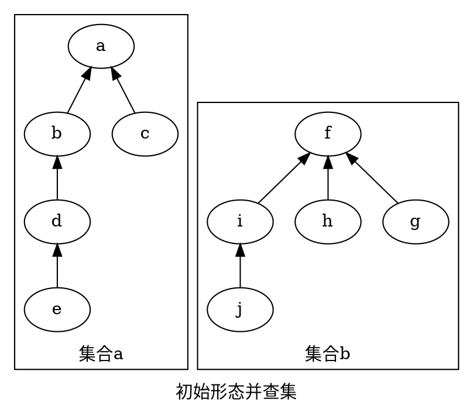
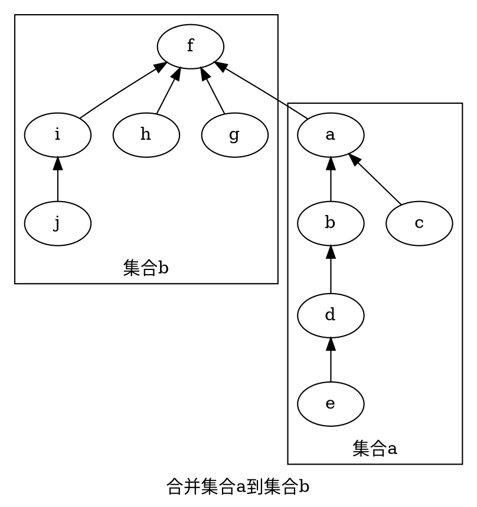
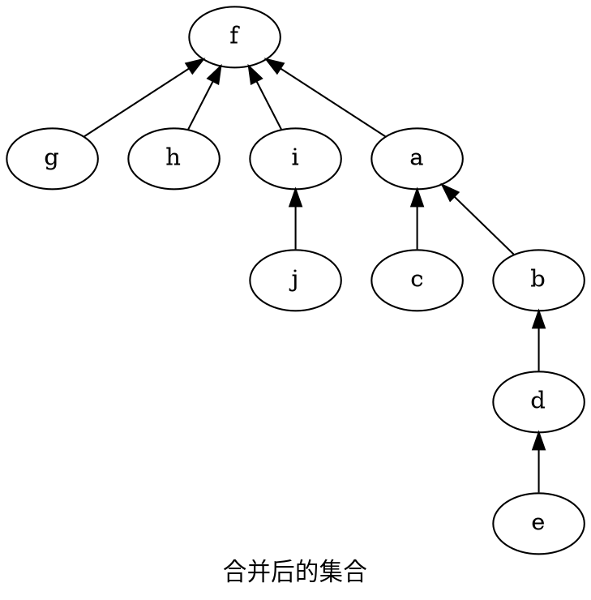

# 并查集(Disjoint Set Union,DSU)

## 1.原理

### 存储

一般用一个数组存储某个节点的父节点(father)，若此节点为根节点(root)则存储为该节点编号。

### 合并集合

时间复杂度: O(1)

目标: 将集合x合并到集合y里

实现: 将集合x的根节点(root)的父节点(father)设为集合y的根节点(root)

### 查找根节点

时间复杂度: O(n) (n为树的深度(depth))

目标: 查找节点node的根节点(root)

实现: 一直查找节点的父节点(father)，直到该节点的父节点(father)为自身，则该节点就是节点node的根节点。

### 优化

主要优化方法有路径压缩、~按秩合并(已弃用)~等

最常见的优化就是路径压缩，可以有效地降低时间复杂度。

路径压缩一般在查找时执行，每次查找时将node的父节点直接指向该节点的根节点。

> [!TIP]
> 路径压缩后，并查集的每个集合[并不始终\*](disjointSet?id=注)为一个菊花图(只有两层的树的俗称)

## 2.代码实现
```cpp
const int SIZE = 1000 + 10;// 可以改成你自己的参数(并查集节点最大值)
int fa[SIZE];
void init(){
  for (int i = 0; i < SIZE; i++ ){
    fa[i] = i;
  }
}
int get_fa(int node){
  if (fa[node] == node){
    return node; //如果父节点是自身，则这个节点就是根节点
  }
  return fa[node] = get_fa(node); //路径压缩
  // return get_fa(node); //不压缩
}
void merge(int x,int y){
  fa[get_fa(x)]=get_fa(y);
}
```

## 3.图解并查集



#### 注
\*:大部分时间不是菊花图
